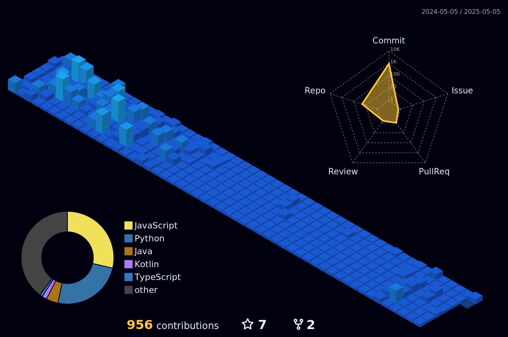

<h1 align="center">Hi 👋, I'm Fahd</h1>
<h3 align="center">A Software Engineer</h3>

  

  

- 🔭 I’m currently working on **Professional Projects**

- 🌱 I’m currently learning **Software Engineering Courses**

- 📫 How to reach me **fahdstudies00@gmail.com**

<h3 align="center">Connect with me:</h3>

<h3 align="center">Languages and Tools:</h3>

              

&nbsp;

